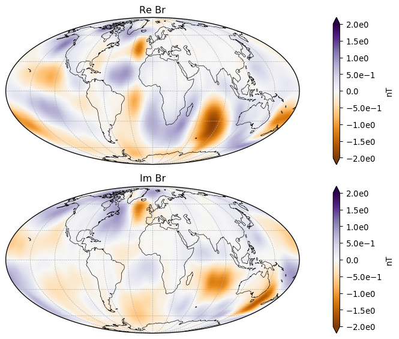
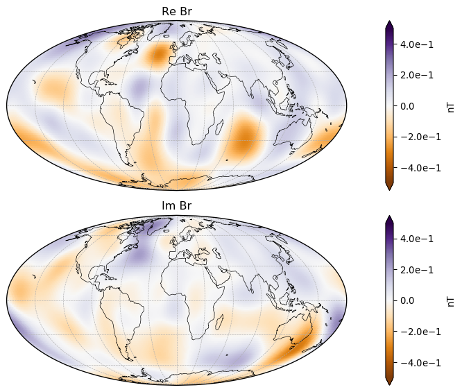
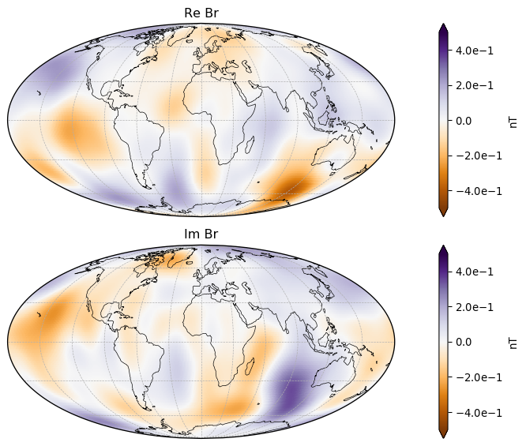

# Magnetic signatures of ocean tidal signals

This repo provides some utilities to calculate and visualize magnetic fields due to different tidal constituents based on their spherical harmonic expansion coefficients. This is meant to support this publication (accepted manuscript can also be found in thisrepository)

> Grayver, A. V., & Olsen, N. (2019). The Magnetic Signatures of the M2, N2, and O1 Oceanic Tides Observed in Swarm and CHAMP Satellite Magnetic Data. Geophysical Research Letters, 46(8), 4230-4238.
> https://doi.org/10.1029/2019GL082400

This repo uses [ChaosMagPy](https://github.com/ancklo/ChaosMagPy)

The figures below show real and imaginary parts since the tidal signals are harmonic and usually analysed in frequency domain.

#### Radial magnetic field component of M2 tide at 430 km extracted Swarm and CHAMP data

#### Same as above, but for N2 tide

#### Same as above, but for O1 tide

