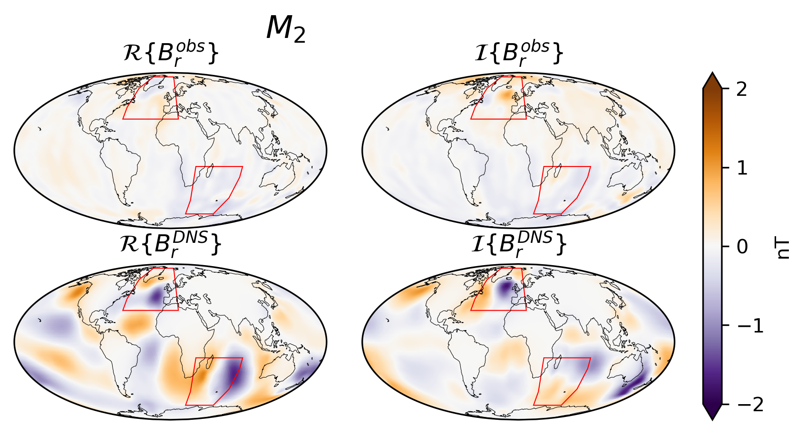
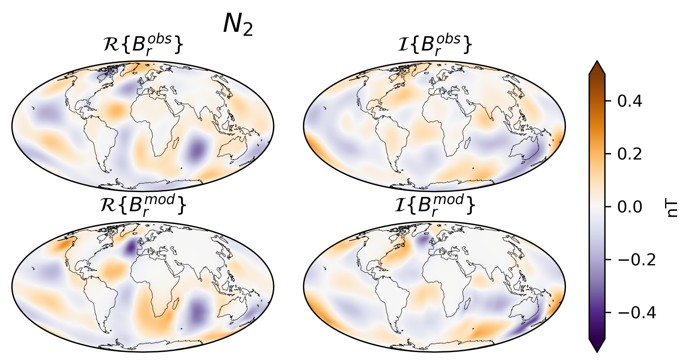
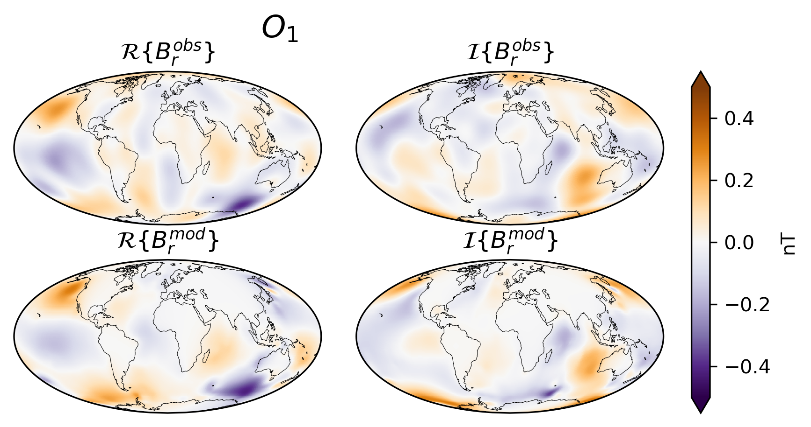
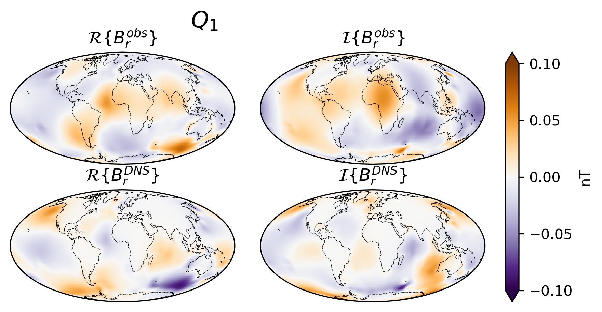

# Magnetic signatures of ocean tidal signals observed by sattelite

This repo provides some utilities to work with satellite-detected magnetic signals due to different ocean tidal constituents based on their Spherical Harmonic expansion coefficients. This repository supplements the following publications:

- Grayver, A., Finlay, C. C., & Olsen, N. (2024). Magnetic signals from oceanic tides: new sat-ellite observations and applications. Philosophical Transactions of the Royal Society of London, doi: 10.1098/rsta.2024.0078. Preprint https://arxiv.org/abs/2404.03504
- Grayver, A. V., & Olsen, N. (2019). "The Magnetic Signatures of the M2, N2, and O1 Oceanic Tides Observed in Swarm and CHAMP Satellite Magnetic Data". *Geophysical Research Letters,* 46(8), 4230-4238. https://doi.org/10.1029/2019GL082400

# Dependencies
- [ChaosMagPy](https://github.com/ancklo/ChaosMagPy)
- [seaborn](https://seaborn.pydata.org/) 
- NumPy / SciPy
- Matplotlib

The figures below show real and imaginary parts since the tidal signals are harmonic phenomena and conventionally analysed as global maps in frequency domain.

#### Radial magnetic field component due to the M2 tide at 430 km extracted Swarm and CHAMP data

Top row shows real and imaginary parts of the signals extracted from satellite observations. Bottom shows result of 3-D numerical simulations. 

#### Same as above, but for N2 tide

#### Same as above, but for O1 tide

#### Same as above, but for Q1 tide

